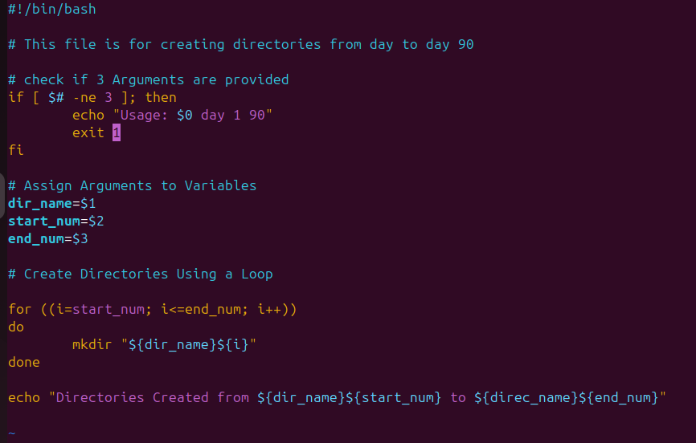
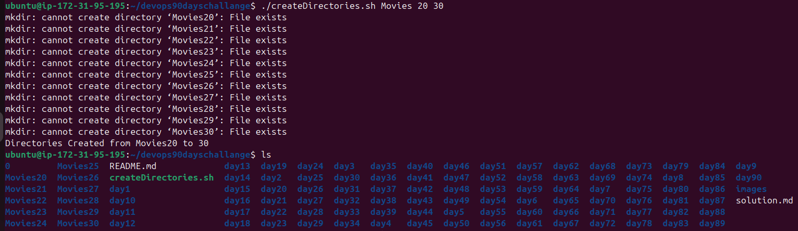
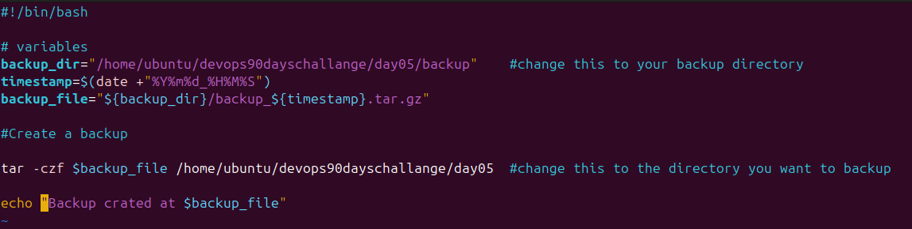
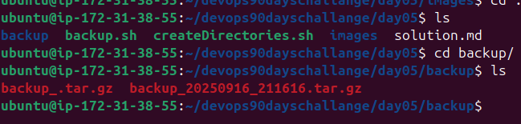

# This is for day 05 tasks solution 

**Tasks 1**

1. Create Directories Using Shell Script:
    - Write a bash script createDirectories.sh that, when executed with three arguments (directory name, start number of directories, and end number of directories), creates a specified number of directories with a dynamic directory name.

        - Example 1: When executed as ./createDirectories.sh day 1 90, it creates 90 directories as day1 day2 day3 ... day90.

        - Example 2: When executed as ./createDirectories.sh Movie 20 50, it creates 31 directories as Movie20 Movie21 Movie22 ... Movie50.

2. Create a Script to Backup All Your Work: 

    - Backups are an important part of a DevOps Engineer's day-to-day activities. The video in the references will help you understand how a DevOps Engineer takes backups (it can feel a bit difficult but keep trying, nothing is impossible).

