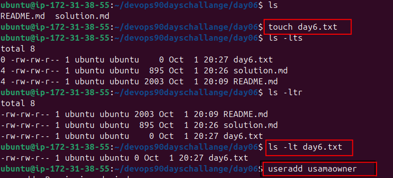
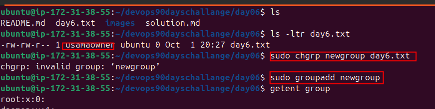
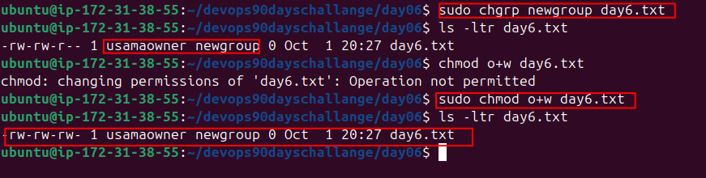

**Day 6 Answers: File Permissions and Access Control Lists**
----------------------------------------------------------------------------------

**Tasks**

1. **Understanding Filr Permissions**

- Create a simple file and run ls -ltr to see the details of the files.
- Each of the three permissions are assigned to three defined categories of users. The categories are:
    - Owner: The owner of the file or application.
        - Use chown to change the ownership permission of a file or directory.
    - Group: The group that owns the file or application.
        - Use chgrp to change the group permission of a file or directory.
    - Others: All users with access to the system (outside the users in a group).
        - Use chmod to change the other users' permissions of a file or directory.
    - Task: Change the user permissions of the file and note the changes after running ls -ltr.

**Answers**
    - file is created 
    - view all permissions of created file
    - add a new user

    ***NOTE** if user is not added use SUDO in start of command***

    - Change the owner of the created file
    - Try to change the group of the file
    - In case of error add SUDO before executing chrg newgroup day06.txt  command
    - New group is added

    - Change the group and now in the screenshot owner and group both are changes
    - change the permission of file (Giving write permission to other user in last line of this screenshot)

