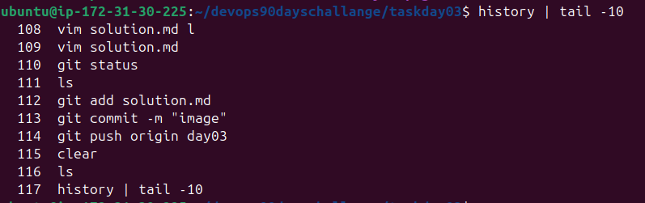

Task 1: View the content of a file and display line numbers.

Task 2: Change the access permissions of files to make them readable, writable, and executable by the owner only.

Task 3: Check the last 10 commands you have run.

Task 4: Remove a file and a directory and all its contents.

