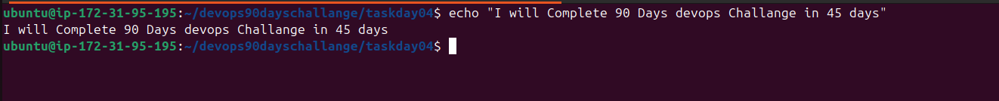
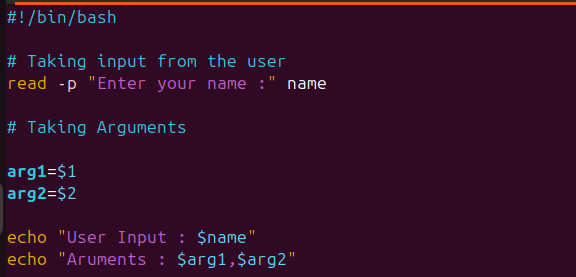
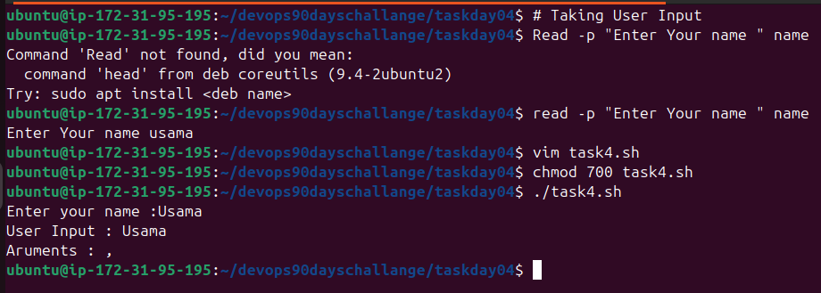
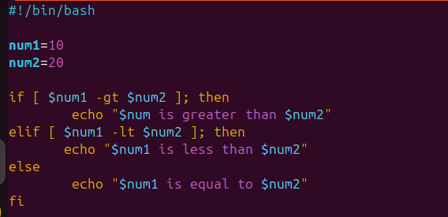
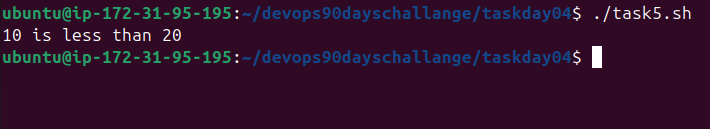

Task 1: Explain in your own words and with examples what Shell Scripting means for DevOps

- Shell scripting is writing a series of commands in a scripts to automate tasks for UNIX/LINUX. In devops Shell scripting is very important to write different types of sripts for repititive tasks, automating the system configurations, deploying the applications and creating the pipelines. it increases efficiency, saves time and human error.

Example is Automating server setups

Task 2: What is #!/bin/bash? Can we write #!/bin/sh as well?

- #!/bin/bash is named as shebang and its written in start of every .sh file. It indicates that script should be run using Bash Script.

    - #!/bin/bash : uses bash as a interpreter. It supports advance features like arrays, assosiative arrays , and functions.
    - #!/bin/sh: Uses the bourne shell. it's more POSIX compliant and is generally compatible with different UNIX shells.

Task 3: Write a Shell Script that prints I will complete #90DaysOfDevOps challenge.

Task 4: Write a Shell Script that takes user input, input from arguments, and prints the variables.

Task 5: Provide an example of an If-Else statement in Shell Scripting by comparing two numbers.

 
